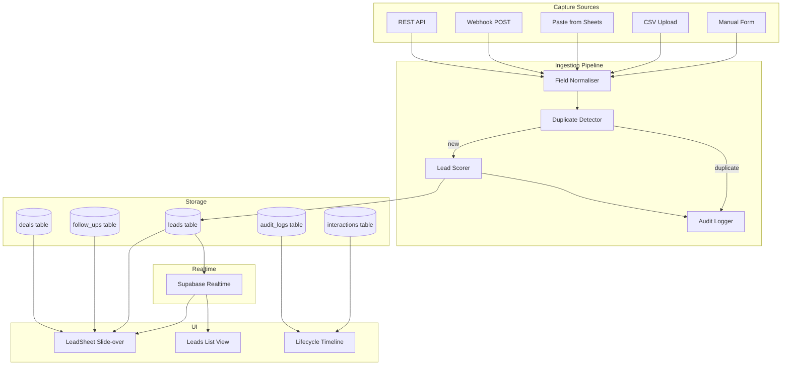
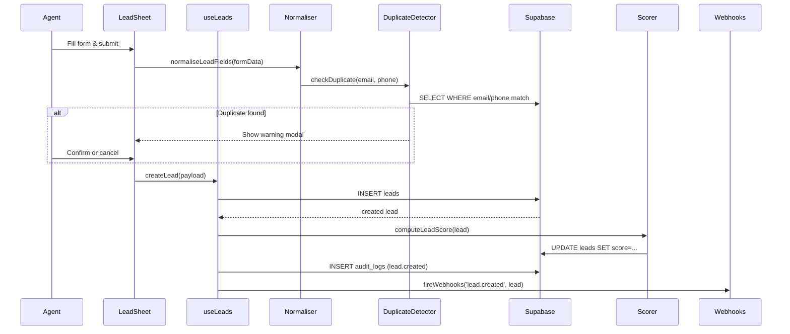
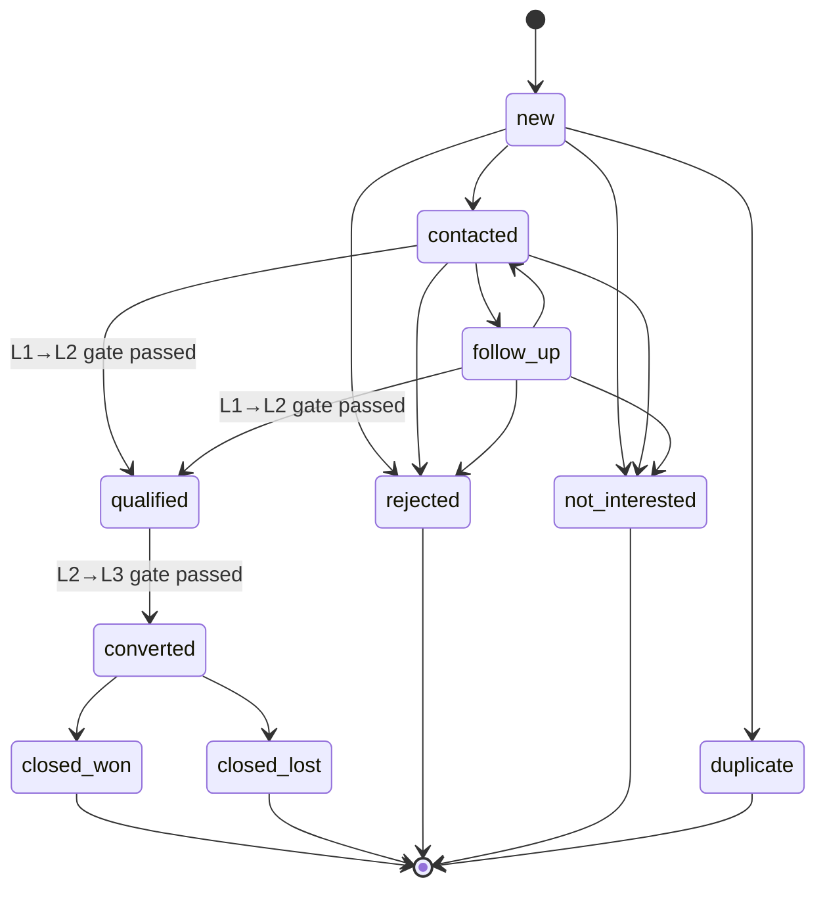

# Design Document — Lead Lifecycle Management

## Overview

This feature redesigns FlowCRM's lead data model and all capture/management flows. The current system stores leads in a minimal table (name, email, phone, company, status, current_level, score, enriched_data JSONB) and navigates to a full page for lead detail. The redesign introduces:

- **Extended schema**: 25+ new first-class columns replacing ad-hoc JSONB storage
- **LeadSheet**: a slide-over panel component replacing page navigation for lead detail
- **Ingestion pipeline**: unified normalisation, deduplication, and scoring for all capture sources (manual, CSV, paste, webhook, API)
- **Lifecycle state machine**: validated stage transitions with gate conditions
- **Lead scoring engine**: deterministic 0–100 score computed from four weighted factors
- **Real-time subscriptions**: per-lead Supabase Realtime channels for live updates

The design is additive — all new columns use `ADD COLUMN IF NOT EXISTS` so the migration is safe to run against the existing database. The existing `enriched_data` JSONB column is retained for arbitrary custom attributes.

### Key Design Decisions

1. **Slide-over panel, not page navigation** — clicking a lead row opens a `LeadSheet` component rendered at the app root level (portal), keeping the list visible behind the panel. This avoids the back-navigation UX problem and allows agents to quickly scan multiple leads.

2. **First-class columns over JSONB** — qualification fields (`budget`, `requirement`, `timeline`, `decision_maker`) and lifecycle timestamps (`qualified_at`, `converted_at`, `closed_at`) are promoted to typed columns. This enables indexed queries, RLS policies, and database-level constraints. The `enriched_data` JSONB column is kept for extensibility.

3. **Client-side scoring with DB persistence** — the lead score is computed in `src/utils/scoring.js` (pure function, easily testable) and written back to the `score` column. A `recalculate_lead_score()` SQL function handles bulk recalculation post-migration.

4. **Supabase Edge Function for webhook ingestion** — the public `/api/webhooks/leads/ingest` endpoint is implemented as a Supabase Edge Function (Deno), which handles token auth, field mapping, deduplication, and lead creation without exposing the service role key to the client.

5. **Fuzzy column mapping via alias tables** — the CSV/paste parser uses an expanded alias table covering all new fields. Unrecognised columns are surfaced in a manual-mapping UI step rather than silently dropped.

---

## Architecture



### Data Flow — Lead Creation



### Lifecycle State Machine



---

## Components and Interfaces

### LeadSheet (new component)

`src/components/leads/LeadSheet.jsx`

A slide-over panel rendered via a React portal at the `#lead-sheet-root` div appended to `document.body`. It receives a `leadId` prop and fetches its own data via `useLead(leadId)`.

```
Props:
  leadId: string | null   — null closes the panel
  onClose: () => void
  defaultSection?: string — scroll to section on open

Sections (rendered as anchor-linked cards):
  1. Identity & Contact
  2. Source & Capture
  3. Qualification Details
  4. Lifecycle Timeline
  5. Interactions
  6. Follow-ups
  7. Deal Information (L2/L3 only)

Internal state:
  editingField: string | null   — field currently in inline-edit mode
  addingInteraction: boolean
  addingFollowUp: boolean
  showQualifyGate: boolean
  showRejectModal: boolean
  showDuplicateWarning: { existing: Lead } | null
```

The panel slides in from the right with a CSS transition (`transform: translateX`). A semi-transparent backdrop covers the list. Pressing Escape or clicking the backdrop closes the panel.

### LeadScorer (updated utility)

`src/utils/scoring.js` — add `computeLeadScore(lead)` alongside the existing `calculateHealthScore`.

```js
// Returns integer 0–100
function computeLeadScore(lead: Lead): number

// Sub-scorers (exported for testing)
function profileCompletenessScore(lead: Lead): number   // 0–25
function interactionCountScore(count: number): number   // 0–25
function recencyScore(lastContactedAt: string | null): number  // 0–25
function qualificationCompletenessScore(lead: Lead): number    // 0–25
```

### DuplicateDetector

`src/utils/duplicates.js` — new utility.

```js
// Normalises phone to E.164 (strips spaces, dashes, parentheses)
function normalisePhone(phone: string): string

// Normalises email to lowercase trimmed
function normaliseEmail(email: string): string

// Queries Supabase for matching email or phone
// Returns existing lead or null
async function findDuplicate(email: string, phone: string): Promise<Lead | null>
```

### FieldNormaliser

`src/utils/normalise.js` — new utility.

```js
// Accepts raw form/CSV/webhook payload, returns normalised lead fields
function normaliseLeadFields(raw: Record<string, unknown>): NormalisedLead
```

Handles: phone E.164 normalisation, email lowercase, `source` enum coercion, `capture_method` defaulting, `captured_at` defaulting to `now()`.

### CSV Parser (extended)

`src/utils/csvParser.js` — extend existing file.

New alias tables added for all Requirement 1 fields:

| Field | Aliases |
|---|---|
| `job_title` | job title, title, position, role, designation |
| `website` | website, url, web, site |
| `linkedin_url` | linkedin, linkedin url, linkedin profile |
| `location` | location, city, address, region |
| `source_detail` | source detail, campaign, referral name |
| `budget` | budget, budget range, spend |
| `requirement` | requirement, needs, use case, pain point |
| `timeline` | timeline, timeframe, deadline |
| `industry` | industry, sector, vertical |
| `company_size` | company size, size, employees, headcount |

New export: `parseCSVText(text, options)` — `options.extraFields: boolean` enables extended field mapping.

### Webhook Edge Function

`supabase/functions/ingest-lead/index.ts`

Deno-based Supabase Edge Function. Handles:
- `POST /functions/v1/ingest-lead`
- Token auth via `X-FlowCRM-Token` header matched against `webhooks.secret` column
- Field mapping via per-integration `config.field_map` JSONB
- Deduplication: if email matches, PATCH existing lead; else INSERT
- Returns 201 (created), 200 (merged duplicate), 422 (validation error), 401 (auth error)

### useLeadSheet hook

`src/hooks/useLeadSheet.js` — new hook managing global LeadSheet state.

```js
// Returns { openLead, closeLead, leadId }
// openLead(id) sets the active leadId
// closeLead() clears it
// Used by App.jsx to render <LeadSheet> at root level
export function useLeadSheet()
```

### useLeads (extended)

`src/hooks/useLeads.js` — extend existing mutations:

- `useCreateLead` — add duplicate check before insert, accept all new fields
- `useUpdateLead` — add audit log write on field change, trigger score recalculation
- `useTransitionLead` — enforce gate conditions (Req 9, 10), set lifecycle timestamps
- `useRejectLead` — require `rejection_reason`, write to first-class column
- `useImportLeads` — accept extended field set, set `capture_method`

New mutations:
- `useInlineUpdateField({ leadId, field, oldValue, newValue })` — writes audit log entry for inline edits

### useLeadRealtime hook

`src/hooks/useLeadRealtime.js` — new hook for per-lead subscriptions.

```js
// Subscribes to interactions and follow_ups for a specific leadId
// Invalidates ['leads', leadId] query on any change
export function useLeadRealtime(leadId: string)
```

---

## Data Models

### Extended `leads` Table

New columns added via `ALTER TABLE … ADD COLUMN IF NOT EXISTS`:

```sql
-- Identity
job_title          TEXT,
website            TEXT,
linkedin_url       TEXT,
location           TEXT,           -- "City, State, Country" free text

-- Source
source_detail      TEXT,           -- campaign name, referral name, etc.
capture_method     TEXT DEFAULT 'manual'
                   CHECK (capture_method IN
                     ('manual','csv','paste','webhook','api','integration')),
captured_at        TIMESTAMPTZ DEFAULT NOW(),

-- Qualification
budget             NUMERIC(14,2),
requirement        TEXT,
timeline           TEXT,
decision_maker     BOOLEAN DEFAULT FALSE,
company_size       TEXT
                   CHECK (company_size IN
                     ('1-10','11-50','51-200','201-1000','1000+')),
industry           TEXT,

-- Lifecycle timestamps
qualified_at       TIMESTAMPTZ,
converted_at       TIMESTAMPTZ,
closed_at          TIMESTAMPTZ,
rejection_reason   TEXT,
lost_reason        TEXT,

-- Engagement
last_contacted_at  TIMESTAMPTZ,
contact_attempts   INTEGER DEFAULT 0,
next_follow_up_at  TIMESTAMPTZ,

-- Ownership
created_by         UUID REFERENCES public.users(id) ON DELETE SET NULL
```

New indexes:

```sql
CREATE INDEX IF NOT EXISTS idx_leads_email         ON leads(email);
CREATE INDEX IF NOT EXISTS idx_leads_phone         ON leads(phone);
CREATE INDEX IF NOT EXISTS idx_leads_status        ON leads(status);
CREATE INDEX IF NOT EXISTS idx_leads_current_level ON leads(current_level);
CREATE INDEX IF NOT EXISTS idx_leads_assigned_to   ON leads(assigned_to);
CREATE INDEX IF NOT EXISTS idx_leads_created_at    ON leads(created_at);
CREATE INDEX IF NOT EXISTS idx_audit_entity_id     ON audit_logs(entity_id);
CREATE INDEX IF NOT EXISTS idx_interactions_lead   ON interactions(lead_id);
```

### `leads` Status Enum (extended)

```
new → contacted → follow_up → qualified → converted → closed_won
                                                     → closed_lost
new → [any] → rejected
new → [any] → not_interested
new → [any] → duplicate
```

The `status` column is `TEXT` with a CHECK constraint updated to include `converted`, `closed_won`, `closed_lost`.

### `webhooks` Table (extended)

Add `secret TEXT` column for per-webhook token authentication:

```sql
ALTER TABLE public.webhooks ADD COLUMN IF NOT EXISTS secret TEXT;
```

### `audit_logs` — action vocabulary (extended)

| action | trigger |
|---|---|
| `lead.created` | any capture source |
| `lead.field_updated` | inline edit in LeadSheet |
| `lead.stage_transition` | lifecycle stage change |
| `lead.level_transition` | L1→L2 or L2→L3 |
| `lead.rejected` | rejection |
| `duplicate_detected` | dedup check match |
| `webhook.received` | ingest-lead function |
| `deal.created` | auto-created on L2→L3 |

### TypeScript-style interfaces (for documentation)

```ts
interface Lead {
  id: string;
  // Identity
  name: string;
  email: string | null;
  phone: string | null;
  company: string | null;
  job_title: string | null;
  website: string | null;
  linkedin_url: string | null;
  location: string | null;
  // Source
  source: LeadSource;
  source_detail: string | null;
  capture_method: CaptureMethod;
  captured_at: string;
  // Qualification
  budget: number | null;
  requirement: string | null;
  timeline: string | null;
  decision_maker: boolean;
  company_size: CompanySize | null;
  industry: string | null;
  // Lifecycle
  status: LeadStatus;
  current_level: PipelineLevel;
  qualified_at: string | null;
  converted_at: string | null;
  closed_at: string | null;
  rejection_reason: string | null;
  lost_reason: string | null;
  // Engagement
  score: number;
  last_contacted_at: string | null;
  contact_attempts: number;
  next_follow_up_at: string | null;
  // Ownership
  assigned_to: string | null;
  created_by: string | null;
  created_at: string;
  updated_at: string;
  enriched_data: Record<string, unknown>;
}

type LeadSource =
  | 'website' | 'referral' | 'linkedin' | 'cold_call'
  | 'typeform' | 'google_forms' | 'widget' | 'csv'
  | 'api' | 'webhook' | 'other';

type CaptureMethod = 'manual' | 'csv' | 'paste' | 'webhook' | 'api' | 'integration';

type LeadStatus =
  | 'new' | 'contacted' | 'follow_up' | 'qualified'
  | 'converted' | 'closed_won' | 'closed_lost'
  | 'rejected' | 'not_interested' | 'duplicate';

type PipelineLevel = 'l1' | 'l2' | 'l3';

type CompanySize = '1-10' | '11-50' | '51-200' | '201-1000' | '1000+';
```

---

## Correctness Properties

*A property is a characteristic or behavior that should hold true across all valid executions of a system — essentially, a formal statement about what the system should do. Properties serve as the bridge between human-readable specifications and machine-verifiable correctness guarantees.*

### Property 1: Lead score is bounded

*For any* lead record with any combination of field values, `computeLeadScore(lead)` SHALL return an integer in the range [0, 100].

**Validates: Requirements 11.1**

---

### Property 2: Lead score sub-components are bounded and sum to total

*For any* lead record and interaction count, each of `profileCompletenessScore(lead)`, `interactionCountScore(count)`, `recencyScore(lastContactedAt)`, and `qualificationCompletenessScore(lead)` SHALL be an integer in [0, 25], and their sum SHALL equal `computeLeadScore(lead)`.

**Validates: Requirements 11.1, 11.4, 11.5, 11.6, 11.7**

---

### Property 3: Phone normalisation is idempotent

*For any* phone string, `normalisePhone(normalisePhone(phone))` SHALL equal `normalisePhone(phone)` — normalising an already-normalised number produces the same result.

**Validates: Requirements 2.4, 12.1**

---

### Property 4: Duplicate detection matches on normalised email and phone

*For any* email string with arbitrary casing and whitespace, `normaliseEmail(email)` SHALL produce a consistent canonical form such that two emails that differ only in case or surrounding whitespace are considered equal. Similarly, *for any* phone string in any common format (E.164, local with spaces/dashes/parentheses), `normalisePhone` SHALL produce the same E.164 string for equivalent numbers.

**Validates: Requirements 1.9, 12.1, 12.3**

---

### Property 5: CSV round-trip preserves all mapped fields

*For any* set of lead rows serialised to CSV with the canonical column headers, `parseCSVText(serialise(rows))` SHALL return rows where every mapped field equals the original value (modulo whitespace trimming).

**Validates: Requirements 3.1, 3.2, 4.1**

---

### Property 6: Rows missing name are excluded from parsed output

*For any* CSV or pasted text where a row has an empty, null, or whitespace-only `name` field, `parseCSVText` SHALL exclude that row from the returned `rows` array and include a descriptive entry in the `errors` array.

**Validates: Requirements 3.4**

---

### Property 7: Terminal status blocks all further transitions

*For any* lead whose `status` is one of `closed_won`, `closed_lost`, `rejected`, `not_interested`, or `duplicate`, `validateTransition(lead, targetStage)` SHALL return `{ valid: false }` for every possible `targetStage`.

**Validates: Requirements 8.1, 8.3, 8.9**

---

### Property 8: L1→L2 gate rejects leads missing any required field or interaction

*For any* lead missing at least one of `budget`, `requirement`, `timeline`, `decision_maker`, or having zero interactions of type `call`, `email`, or `meeting`, or having `score < 30`, `validateL1Gate(lead, interactions)` SHALL return `{ valid: false, errors }` with a non-empty `errors` array naming each unmet condition.

**Validates: Requirements 9.1, 9.2, 9.3, 9.4**

---

### Property 9: Milestone transitions set the correct lifecycle timestamp

*For any* lead transitioning to `qualified`, `converted`, `closed_won`, or `closed_lost`, the corresponding timestamp field (`qualified_at`, `converted_at`, `closed_at`) SHALL be set to a timestamp within 1 second of the transition time, and SHALL NOT be null after the transition.

**Validates: Requirements 8.5, 8.6, 8.7**

---

### Property 10: Rejection requires a non-empty reason

*For any* rejection attempt where `rejection_reason` is null, empty, or composed entirely of whitespace, `validateRejection(reason)` SHALL return `{ valid: false }` and the transition SHALL NOT be persisted.

**Validates: Requirements 8.8**

---

### Property 11: Round-robin assignment cycles through all available agents

*For any* non-empty list of L2 agents, calling `roundRobinAssign(agents)` N times (where N = agents.length) SHALL return each agent exactly once, and the (N+1)th call SHALL return the same agent as the 1st call.

**Validates: Requirements 9.6**

---

### Property 12: Webhook field mapping applies config correctly

*For any* field-map configuration object and any incoming JSON payload, `applyFieldMap(config, payload)` SHALL return an object where every key defined in the config is renamed to its mapped target key, and keys not in the config are passed through unchanged.

**Validates: Requirements 5.2**

---

### Property 13: Lifecycle timeline events are sorted reverse-chronologically

*For any* array of timeline events (from `audit_logs` and `interactions`) with arbitrary `created_at` timestamps, `sortTimeline(events)` SHALL return the events ordered from newest to oldest (descending `created_at`).

**Validates: Requirements 13.1**

---

### Property 14: Stage transition events include required display fields

*For any* stage transition audit log entry with `from_stage`, `to_stage`, and `actor_id` fields, `formatTimelineEvent(entry)` SHALL return a string or object that contains the `from_stage` value, the `to_stage` value, and the actor's name.

**Validates: Requirements 13.3**

---

### Property 15: Capture method is set correctly per ingestion source

*For any* lead payload processed through the ingestion pipeline, the resulting lead record SHALL have `capture_method` equal to `'manual'` for form submissions, `'csv'` for CSV imports, `'paste'` for paste imports, `'webhook'` for webhook ingestion, and `'api'` for API ingestion — regardless of the payload content.

**Validates: Requirements 2.6, 3.6, 4.4, 5.4**

---

### Property 16: Score colour indicator matches threshold

*For any* integer score in [0, 100], `getScoreColour(score)` SHALL return `'green'` when `score >= 75`, `'amber'` when `50 <= score < 75`, and `'red'` when `score < 50`.

**Validates: Requirements 7.4**

---

## Error Handling

### Ingestion Errors

| Scenario | Behaviour |
|---|---|
| CSV row missing `name` | Row marked invalid, skipped from import, error shown in preview |
| CSV row with duplicate email | Row flagged `DUPLICATE` in preview, excluded from default selection |
| Webhook missing `name` | HTTP 422 returned with `{ error: "name is required" }` |
| Webhook invalid token | HTTP 401 returned, no lead created, no audit log |
| Webhook duplicate email | HTTP 200 returned, existing lead merged, audit log written |
| API auth failure | HTTP 401 returned |
| API rate limit exceeded | HTTP 429 returned with `Retry-After` header |
| DB insert failure | Toast error shown, mutation rolls back, no partial state |

### Transition Errors

Gate validation runs client-side (fast feedback) and is re-validated server-side in the mutation before the DB write. If the client-side check passes but the server-side check fails (race condition), the mutation throws and the UI shows the unmet conditions.

### Inline Edit Errors

If an inline edit fails to save (network error, RLS violation), the field reverts to its previous value and a toast error is shown. The optimistic update is rolled back by TanStack Query's `onError` handler.

### Real-time Subscription Errors

If a Supabase Realtime channel disconnects, `useLeadRealtime` logs a warning and attempts reconnection with exponential backoff (handled by the Supabase client). The UI shows stale data until reconnection; no error is surfaced to the user unless the channel fails to reconnect after 30 seconds.

---

## Testing Strategy

### Unit Tests

Focus on pure functions that are easy to isolate:

- `computeLeadScore` and all four sub-scorers — test boundary values (0 interactions, 5 interactions, >5 interactions; recency at exactly 24h, 48h, 7d, 30d boundaries)
- `normalisePhone` — test E.164 output for Indian, US, and UK formats; test idempotence
- `normaliseEmail` — test case folding and whitespace trimming
- `validateTransition` — test each terminal status blocks all transitions; test each gate condition individually
- `validateL1Gate` / `validateL2Gate` — test each required field missing in isolation
- `parseCSVText` — test comma-delimited, tab-delimited, quoted fields, missing name rows, duplicate email rows

### Property-Based Tests

Using [fast-check](https://github.com/dubzzz/fast-check) (already compatible with Vitest).

Each property test runs a minimum of 100 iterations.

Tag format: `// Feature: lead-lifecycle-management, Property N: <property text>`

**Property 1 test** — generate arbitrary lead objects with `fc.record(...)`, assert `computeLeadScore(lead)` is always in [0, 100].

**Property 2 test** — generate arbitrary lead objects, assert sub-scores each in [0, 25] and sum equals total score.

**Property 3 test** — generate arbitrary phone strings with `fc.string()`, assert `normalisePhone(normalisePhone(s)) === normalisePhone(s)`.

**Property 4 test** — generate email strings with random casing and whitespace, assert `normaliseEmail` produces consistent matches.

**Property 5 test** — generate arrays of lead row objects, serialise to CSV, parse back, assert field equality.

**Property 6 test** — generate leads with terminal statuses, generate arbitrary target stages, assert all transitions rejected.

**Property 7 test** — generate leads with at least one missing gate field, assert gate returns invalid.

**Property 8 test** — generate raw payloads with non-null identity fields, assert normaliser preserves them.

### Integration Tests

- `useCreateLead` mutation: mock Supabase, assert audit log written and webhook fired
- `useTransitionLead` mutation: mock Supabase, assert gate validation runs before DB write
- `useImportLeads` mutation: mock Supabase, assert `capture_method = csv` set on all rows
- Webhook Edge Function: use Supabase local dev, POST valid and invalid payloads, assert HTTP status codes and DB state

### Smoke Tests

- Migration idempotency: run `schema.sql` twice against a blank Supabase project, assert no errors
- Seed: run `seed.sql`, assert at least 10 leads, 3 users, and 1 deal exist
- App startup: with valid `.env.local`, assert no console errors on first load
